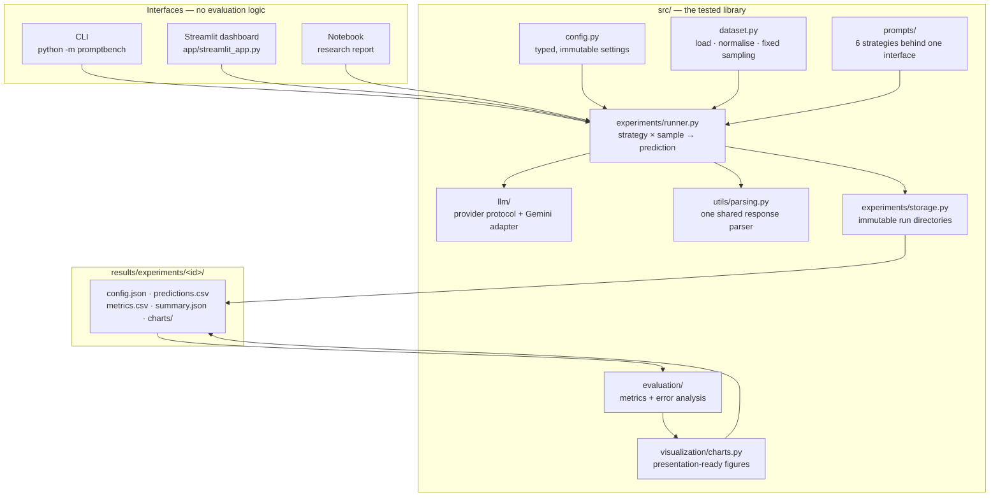
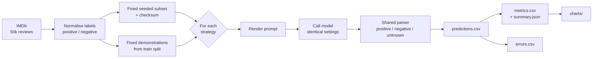

# PromptBench

### An empirical study of prompt strategies for LLM sentiment classification

<p>
  
  
  
  
</p>

A local-first, reproducible evaluation harness that measures how much **prompt strategy
alone** changes an LLM's performance on a sentiment benchmark — with the model, dataset,
evaluation samples, decoding settings, and scoring methodology all held constant.

> **Status:** the system is complete and tested end to end. No full benchmark has been
> published yet, so every results table below reads
> **"Benchmark results will be populated after the first real experiment."**
> That is deliberate: this repository never shows a number it did not measure.

---

## 1. Overview

PromptBench treats prompt engineering as a **measurable engineering variable** rather than
a matter of taste. It runs six genuinely different prompt strategies over one fixed set of
IMDb reviews, using one model, one temperature, one parser and one metric implementation,
then reports what changed.

It ships three interfaces over the same tested library:

| Interface | Command | Best for |
| --- | --- | --- |
| **CLI** | `python -m promptbench benchmark --samples 100` | Real runs; survives a closed laptop |
| **Dashboard** | `streamlit run app/streamlit_app.py` | Exploring prompts and results interactively |
| **Notebook** | `notebooks/prompt_strategy_comparison.ipynb` | Reading the study as a research report |

None of them contains evaluation logic. All three call the same modules in `src/`, which
are covered by **693 tests** that never touch the network.

**What makes this more than a script**

- A **fixed, seeded** evaluation subset, checksummed into every experiment's metadata, so
  two runs can be *proven* to have been scored on identical reviews.
- **One shared parser** for all strategies — a lenient parser would hand its strategy free
  accuracy and the benchmark would measure parsing, not prompting.
- **Unparseable answers are a first-class outcome**, counted separately from wrong answers,
  because the two failures call for completely different fixes.
- **Immutable experiment records.** A completed run is never overwritten; ids are never
  reissued, even after a deletion.
- **Provider-agnostic core.** The runner depends on a protocol, not on a vendor SDK — which
  is exactly why the whole suite runs against a fake provider.

---

## 2. Why this project?

Most prompt-engineering material demonstrates one prompt on a handful of cherry-picked
inputs and declares a technique effective. That tells you nothing about whether it
generalises, whether it survives a controlled comparison, or what it costs.

Three things bothered me enough to build this:

1. **"Add a role and it gets smarter" is untested folklore.** It might be true. It might be
   noise. Nobody in the blog posts ran a control.
2. **Accuracy hides the failure that actually breaks production systems.** A model that
   classifies perfectly but answers in prose your parser cannot read has a 0% success rate
   in a real pipeline. Most write-ups never separate the two.
3. **"Better prompt" claims rarely mention cost.** A strategy that wins by one point while
   tripling prompt length is a different engineering decision, not a free win.

So the goal was not to find the best prompt. It was to build apparatus honest enough that
**a null result would be publishable** — if six genuinely different prompts land within a
point of each other, that is useful evidence against a widely repeated claim.

---

## 3. Research question

> **How much can prompt strategy affect the performance of an LLM on sentiment
> classification when the model, dataset, test samples, and evaluation methodology remain
> controlled?**

A secondary question follows from it:

> **Do prompt techniques compose?** If a role helps and demonstrations help, does using
> both help more — or do longer prompts dilute each instruction?

That second question is why the *combined* strategy exists, and why its result is only
interpretable after each component has been measured alone.

---

## 4. Hypotheses

Every hypothesis was written **before any benchmark was run** and lives in the strategy
class itself, so results are read against a prediction rather than explained after the fact.

| Strategy | Hypothesis (stated in advance) |
| --- | --- |
| **Zero-shot** | Establishes the performance floor. Competent on clearly polarised reviews, weakest on mixed sentiment, most prone to answering in a sentence instead of a label. |
| **Few-shot** | Demonstrations anchor the label space and the response format, so the unparseable rate should drop. Accuracy gains depend on whether the examples resemble the graded reviews. |
| **Role-based** | Framing the task as professional annotation against a stated guideline should sharpen decisions on ambiguous reviews, where the guideline supplies a tie-break the baseline lacks. |
| **Structured output** | Should minimise unparseable responses, raising *effective* accuracy even if the underlying judgement is unchanged. The format constraint alone is not expected to improve classification quality. |
| **Reasoning-aware** | Should help most on genuinely mixed reviews. Because no reasoning is emitted, any gain must come from the instruction itself, not from extra output tokens. |
| **Combined** | If the mechanisms are complementary this should be strongest. If they interfere, it may underperform its own best component — which is the informative outcome either way. |

**A prediction about the experiment as a whole:** the largest single effect will come from
**format reliability**, not judgement. A model that already classifies sentiment well can
still lose accuracy by answering unreadably — and that is a failure a prompt can fix outright.

---

## 5. Architecture



**The dependency that matters:** `runner.py` imports the `LLMProvider` *protocol*, never
the Gemini SDK. Adding a second provider means writing one adapter — the runner, metrics,
error analysis and charts do not change. It is also why 693 tests run offline.

### Experiment flow



Note that **C feeds every strategy unchanged**. That single arrow is the experiment's
control; everything else is bookkeeping around it.

---

## 6. Prompt strategies

Six strategies, each adding **exactly one mechanism** to the baseline. They differ
structurally, not by wording — a test asserts that demonstrations appear only in the
few-shot family, a persona only in the role family, and so on.

| # | Strategy | Added mechanism | How it works |
| --- | --- | --- | --- |
| 1 | **Zero-shot** | — *(control)* | Task, label vocabulary, review. Nothing else. |
| 2 | **Few-shot** | In-context learning | Fixed, class-balanced solved examples, alternating labels so the last demo is never one class |
| 3 | **Role-based** | Persona + guideline | Expert annotator in the **system slot**, shipped with the numbered rules it works to |
| 4 | **Structured output** | Output contract | One JSON object, explicit prohibitions on fences, preambles and extra keys |
| 5 | **Reasoning-aware** | Decision procedure | Four-point checklist for mixed sentiment, sarcasm and plot-versus-opinion; label only |
| 6 | **Combined** | Composition | Role + demonstrations + procedure + JSON, importing the components verbatim |

Three design decisions worth surfacing in a code review:

- **Role-based is not an adjective swap.** The persona occupies the system slot — a
  structural difference from the baseline — and ships with an operational guideline
  ("a review that criticises details but recommends the film is positive", "never abstain").
- **Structured output uses prompt text only.** Provider-side constrained decoding would
  change *generation settings* and stop this being a prompt-only comparison.
- **Combined imports its components** rather than restating them. Edit the role and the
  combined strategy changes with it; a copy-paste would silently drift and quietly
  invalidate the comparison.

**Chain-of-thought policy.** The reasoning strategy asks the model to weigh evidence
*silently* and return only the verdict. No reasoning is requested, returned or stored —
`predictions.csv` holds the label and the raw response, nothing hidden.

---

## 7. Dataset

**IMDb movie reviews** (`stanfordnlp/imdb` on Hugging Face) — 25,000 train / 25,000 test,
balanced, binary sentiment.

| Property | Value |
| --- | --- |
| Prepared test reviews | ~24,800 after cleaning |
| Mean review length | ~1,270 characters |
| Median / longest | ~950 / ~12,700 characters |
| Class balance | Near-even positive / negative |

It is a good benchmark here precisely because it is **not easy**: reviews are long,
frequently mixed ("the acting was superb, the script was not"), and often sarcastic. That
is where prompt design has room to matter.

**Preparation** (`src/dataset.py`) normalises labels to `positive` / `negative`, strips the
literal `<br />` markup IMDb carries (noise you would otherwise pay tokens to send),
collapses whitespace, drops empty and duplicate reviews, and assigns a stable `sample_id`
derived from the **original row position** — so any row in `errors.csv` traces back to the
exact source record even after filtering.

**Demonstrations come from the *train* split** and exclude every evaluation sample, so no
graded review can ever appear inside a prompt. A test asserts zero overlap.

---

## 8. Experimental design

A controlled experiment with exactly one independent variable.

**Procedure**

1. Load IMDb; normalise labels.
2. Draw **one fixed, seeded** evaluation subset — stratified, so accuracy cannot be
   inflated by an unbalanced draw.
3. Draw **fixed demonstrations** from the train split, excluding every evaluation sample.
4. For each strategy: render a prompt per review, call the model with identical settings.
5. Parse every response with **one shared parser** into `positive` / `negative` / `unknown`.
6. Score accuracy, precision, recall, F1 and a confusion matrix.
7. Persist predictions, metrics, errors and metadata under an immutable experiment id.

**Integrity rules that constrain the whole system**

- No fabricated numbers. Every metric traces back to a stored raw response.
- Failed API calls and unparseable answers are counted and reported, never dropped — a
  failed call still produces a row, because dropping it would quietly shrink the
  denominator of every metric.
- Observed results and their interpretation are stated separately.
- No hidden chain-of-thought is requested or stored.
- A tie is reported as a tie. `best_strategy` returns `null` rather than inventing a winner.

---

## 9. Controlled variables

| Held constant | Why it matters |
| --- | --- |
| **Model identifier** | Hosted models change; the exact id is recorded in every run |
| **Temperature** (`0.0`) | The most repeatable decoding the provider offers |
| **Max output tokens** | Answers are one word or a small JSON object |
| **Thinking budget** (`0`) | Model-side reasoning of unknown length would vary per prompt and confound a comparison meant to be about prompt text |
| **Evaluation samples** | The same fixed rows, checksummed, for every strategy |
| **Ground-truth labels** | Normalised once, before any strategy runs |
| **Random seed** | Same seed + size always selects the same reviews |
| **Response parser** | One implementation, shared by all six |
| **Metric computation** | One implementation, applied identically |

**Varied:** the prompt strategy. That is the whole point.

> **A model-selection constraint worth documenting.** Disabling model-side thinking is not
> universally supported. Verified 2026-08-23: `gemini-3.5-flash` accepts `thinking_budget=0`;
> `gemini-3.6-flash` rejects it with HTTP 400; `gemini-3.7-flash` cannot disable it either
> and returns `MAX_TOKENS` with no text. The default model was chosen for methodological
> reasons, not convenience.

---

## 10. Evaluation metrics

**Classification quality:** accuracy, precision, recall, F1 (per class and macro-averaged),
and a confusion matrix per strategy.

**Operational:** total samples, correct, incorrect, unknown/unparseable, API failures,
runtime, average latency per call, and token usage where the provider reports it.

### How `unknown` is handled — the decision that shapes every number

An `unknown` prediction means the response could not be parsed into a label. It is **never
silently dropped**:

| Metric | Treatment |
| --- | --- |
| `accuracy` | Counts as **incorrect**. Denominator stays the full sample count. |
| precision / recall / F1 | Scored over the two real classes. An unknown is *no prediction made*: it **costs recall**, never **pollutes precision**. |
| `accuracy_on_resolved` | Secondary figure over readable answers only — separates *judgement* from *format reliability*. |
| `unknown_rate` | Reported as a first-class metric beside every score. |
| Confusion matrix | Gets its own `unknown` **column**, always present even when zero, so all strategies share one shape. |

> **⚠️ Consequence, stated up front.** Under macro-F1, **abstaining scores better than being
> wrong**. A strategy that returns unreadable answers on hard samples can outrank one that
> guesses and misses, at identical accuracy. This is the standard treatment for an
> abstention, and it is exactly why `unknown_rate` sits next to F1 everywhere in this
> repository — in the CLI summary, the dashboard, the notebook and `summary.json`.
> **Read F1, accuracy and unknown rate together. Never rank on one number.**

`accuracy_on_resolved` returns `None`, not `0.0`, when nothing resolved — undefined is not
the same as "got everything wrong".

---

## 11. Error analysis

Every incorrect prediction is stored with the context needed to judge it:

```
sample_id · strategy · review · actual_label · predicted_label · raw_response · error_type
```

Keeping the **raw response** is what makes a claim about *why* a strategy failed checkable
rather than asserted.

Errors are split by cause, because the two need completely different fixes:

- **`misclassification`** — a readable label, and it was wrong. A *judgement* failure.
- **`unparseable`** — no label could be extracted. A *format* failure.

The analysis layer answers three questions:

| Function | Question |
| --- | --- |
| `summarize_errors_by_strategy` | Does this strategy fail by misjudging, or by being unreadable? |
| `find_shared_errors` | Which samples did **every** strategy get wrong? |
| `unique_errors` | What does this particular design uniquely break? |

**Shared errors are the most informative rows in the experiment.** A review no prompt
design rescues is evidence about the *data* — genuine ambiguity, or a questionable gold
label — rather than about any strategy. If most surviving errors are of that kind, the
ceiling is the dataset, not the prompt.

---

## 12. Results

> **Benchmark results will be populated after the first real experiment.**

The apparatus is complete and verified end to end against mocked providers; no full
benchmark has been executed and published yet. When one runs, this section will carry the
metric table and the five charts, generated from `results/experiments/<id>/` and never
written by hand.

To produce them:

```bash
python -m promptbench benchmark --samples 100
```

Each run writes `config.json`, `predictions.csv`, `metrics.csv`, `summary.json` and
`charts/` into its own immutable directory.

---

## 13. Example findings

> **Benchmark results will be populated after the first real experiment.** The templates
> below show the *form* every finding must take — a claim, the figure that supports it, and
> where that figure comes from. Bracketed placeholders are **not** results.

Each finding in this repository must answer a question and cite a number:

**1. Did prompt strategy matter at all?**
> *Template:* "F1 across six strategies ranged `[min]`–`[max]` on `[n]` samples
> (`metrics.csv`). A spread of that size on `[n]` samples is / is not larger than run-to-run
> variance." — *A one-point spread on 100 samples is inside the noise. Say so.*

**2. Was the effect judgement or format?**
> *Template:* "Strategy X improved accuracy by `[Δ]`, of which `[Δ_unknown]` came from
> eliminating unparseable answers (`accuracy` vs `accuracy_on_resolved`)." — *If those two
> diverge, the strategy changed readability, not reasoning. Often the larger and more
> useful finding.*

**3. Did the techniques compose?**
> *Template:* "Combined scored `[F1]` against its best single component's `[F1]`." — *If
> it underperforms, longer prompts likely diluted each instruction. That is a real result,
> not a failed experiment.*

**4. What survived every strategy?**
> *Template:* "`[k]` of `[n]` samples were misjudged by all six (`find_shared_errors`).
> Reading them: `[characterisation]`."

**5. Was the winner worth its cost?**
> *Template:* "The top strategy used `[x]`× the prompt characters and `[y]`s more per call
> for `[Δ]` accuracy."

A claim not backed by a figure in `metrics.csv`, `errors.csv` or `summary.json` does not
belong in this section.

---

## 14. Project structure

```
promptbench/
├── src/
│   ├── config.py                 # Typed, immutable settings; loads .env; never holds the key
│   ├── dataset.py                # IMDb loading, label normalisation, fixed seeded sampling
│   ├── cli.py                    # Command-line entry point
│   ├── prompts/
│   │   ├── base.py               # Strategy contract + shared validation (template method)
│   │   ├── zero_shot.py          # Control condition
│   │   ├── few_shot.py           # In-context learning
│   │   ├── role_based.py         # Persona + annotation guideline
│   │   ├── structured.py         # JSON output contract
│   │   ├── reasoning.py          # Silent decision procedure
│   │   └── combined.py           # Composition (imports its components)
│   ├── llm/
│   │   ├── base.py               # Provider-neutral protocol; no vendor SDK
│   │   └── gemini.py             # Gemini adapter, retries, usage capture
│   ├── evaluation/
│   │   ├── metrics.py            # Accuracy, P/R/F1, confusion matrix, unknown policy
│   │   └── errors.py             # Error extraction and cross-strategy comparison
│   ├── experiments/
│   │   ├── runner.py             # Benchmark loop: strategy × sample → prediction
│   │   └── storage.py            # Immutable run directories, id allocation
│   ├── visualization/charts.py   # Five presentation-ready figures
│   └── utils/parsing.py          # Shared response parser
├── app/
│   ├── streamlit_app.py          # Interactive dashboard
│   └── ui.py                     # Caching and presentational helpers
├── notebooks/
│   └── prompt_strategy_comparison.ipynb   # 63-cell research report
├── tests/                        # 693 tests; not one makes an API call
├── results/experiments/<id>/     # Immutable: config, predictions, metrics, summary, charts
├── promptbench.py                # Entry-point shim for `python -m promptbench`
├── requirements.txt · pyproject.toml · .env.example
```

Responsibilities are separated so each layer is testable alone: the parser is tested
against 190 hand-written responses, metrics against hand-counted predictions, the runner
against a scripted fake provider.

---

## 15. Local setup

Requires **Python 3.11+** (built and verified on 3.13). No GPU, no Colab, no cloud account
beyond a free Gemini key. Steps 1–3 need **no API key at all**.

```bash
git clone <repository-url>
cd <repository-folder>

python3 -m venv .venv
source .venv/bin/activate            # Windows: .venv\Scripts\Activate.ps1

pip install --upgrade pip
pip install -r requirements.txt
pip check                            # expect: "No broken requirements found."

cp .env.example .env                 # then add your key
```

Get a free key at <https://aistudio.google.com/apikey>.

Verify the connection with a single real call:

```bash
python -m src.llm.gemini
python -m src.llm.gemini --strategy structured "Utterly tedious. I walked out."
```

It prints the model, prompt size, latency, token usage and the raw response, and exits
non-zero on failure.

---

## 16. Environment variables

Copy `.env.example` to `.env`. **`.env` is git-ignored and the key is never printed,
logged, or stored on a config object** — a test asserts it appears in neither `repr()` nor
the serialised configuration.

| Variable | Default | Purpose |
| --- | --- | --- |
| `GEMINI_API_KEY` | *(required)* | Read from the environment only. Never hardcoded. |
| `PROMPTBENCH_MODEL` | `gemini-3.5-flash` | Held constant across strategies |
| `PROMPTBENCH_TEMPERATURE` | `0.0` | Most repeatable decoding available |
| `PROMPTBENCH_BENCHMARK_SAMPLE_SIZE` | `100` | Samples in a full run |
| `PROMPTBENCH_DEV_SAMPLE_SIZE` | `10` | Samples in a smoke run |
| `PROMPTBENCH_RANDOM_SEED` | `42` | Controls which reviews are selected |
| `PROMPTBENCH_LOG_LEVEL` | `INFO` | `DEBUG` … `CRITICAL` |
| `PROMPTBENCH_RESULTS_DIR` | `results` | Relative paths resolve from the repo root |

Configuration is validated at construction: an out-of-range temperature, a non-numeric
seed or an unknown log level fails immediately with a message naming the offending
variable — not mid-benchmark, after money has been spent.

---

## 17. Running tests

```bash
pytest                       # 693 tests
pytest tests/test_parsing.py -v
pytest -k "unknown"          # the unknown-prediction policy
```

**No test makes an API call and no test downloads anything.** Providers are replaced with
scripted fakes, the Hugging Face loader is mocked, and storage tests write to a temporary
directory. The suite runs offline in about 8 seconds and costs nothing — run it before
anything else to confirm your environment is wired correctly.

| Suite | Covers |
| --- | --- |
| `test_config.py` | Validation, env parsing, credential safety |
| `test_dataset.py` | Normalisation, cleaning, **reproducible sampling, leak-free demos** |
| `test_prompts.py` | Contract tests over every strategy; **mechanism distinctness** |
| `test_parsing.py` | 190 response shapes — what must resolve, and what must **refuse** to |
| `test_metrics.py` | Hand-counted metrics; the **unknown policy**; error analysis |
| `test_llm.py` | Retries, error classification, usage capture, key never leaks |
| `test_experiment.py` | Identical samples per strategy, immutability, metadata |
| `test_charts.py` | Bar lengths equal actual values; nothing faked when data is absent |
| `test_cli.py` | Argument parsing and fully mocked execution |

---

## 18. Running a development experiment

Always do this first. It exercises the entire pipeline on a handful of samples so a
configuration mistake costs pennies rather than an afternoon of quota.

```bash
python -m promptbench dev
python -m promptbench dev --strategies zero_shot structured
python -m promptbench dev --no-save          # run without writing anything
```

It runs all eleven pipeline steps — configuration, dataset, fixed subset, fixed
demonstrations, provider, all strategies, predictions, metrics, results, charts, summary —
and prints:

```
============================================================================
  Experiment 2026-08-24_001
============================================================================
  Model        gemini-3.5-flash   temperature 0.0
  Dataset      imdb · 10 samples · seed 42 · checksum <16-hex>
  Totals       60 predictions · … correct · … unparseable · … API failures
----------------------------------------------------------------------------
  strategy       accuracy      F1   errors  unknown   latency
  …
----------------------------------------------------------------------------
  Best by F1   …
  Note         F1 alone can flatter a strategy that abstains …
============================================================================
```

---

## 19. Running the full benchmark

```bash
python -m promptbench benchmark --samples 100
python -m promptbench benchmark --samples 200 --seed 7
python -m promptbench benchmark --samples 50 --strategies zero_shot few_shot combined
```

**Flags:** `--samples` `--strategies` `--seed` `--model` `--temperature` `--experiment-id`
`--examples-per-class` `--no-charts` `--no-save` `--quiet` `--yes`

A run above 120 calls asks for confirmation first, so a mistyped `--samples` cannot quietly
spend your quota; `--yes` skips it, and a non-interactive session without `--yes` refuses
rather than blocking. Authentication failures abort immediately instead of writing hundreds
of identical errors.

**Cost and time.** Six strategies × 100 samples = 600 calls, roughly 15 minutes at ~1.4s per
call on `gemini-3.5-flash`. Comfortably inside the free tier at the time of writing.

### Interactive dashboard

```bash
streamlit run app/streamlit_app.py
```

Five tabs: **Overview** (question, method, hypotheses) · **Prompt explorer** (see the exact
prompt, run one call, read the raw response beside the parsed label) · **Run benchmark**
(call count and estimate before spending, live progress) · **Results** (tables, charts,
error analysis, CSV downloads) · **Past experiments**.

---

## 20. Notebook usage

```bash
python -m ipykernel install --user --name promptbench --display-name "Python (promptbench)"
jupyter lab notebooks/prompt_strategy_comparison.ipynb
```

Select the **Python (promptbench)** kernel and run top to bottom. 22 sections, from the
research question through methodology, prompt examples, results, error analysis, findings,
limitations and reproducibility.

- **API cells are off by default** (`RUN_LIVE_DEMO`, `RUN_BENCHMARK`). The notebook reads
  the newest stored experiment from `results/experiments/` instead.
- **Sections report "Not yet evaluated"** when no experiment exists, rather than showing
  placeholders.
- **It imports from `src/` and defines no business logic** — a structural check greps for
  inline sklearn calls, direct SDK use and hand-rolled charts.
- Committed **without stored outputs**, so diffs stay readable.

---

## 21. Reproducibility

Every run writes an immutable directory keyed by experiment id (`YYYY-MM-DD_NNN`):

```
results/experiments/2026-08-24_001/
├── config.json        # model, temperature, seed, sample ids + checksum, strategies, hypotheses
├── predictions.csv    # one row per (strategy, sample) with the raw response
├── metrics.csv        # per-strategy scores — re-derivable from predictions.csv
├── summary.json       # headline result, ranking, totals
└── charts/            # the five figures as PNGs
```

**What is guaranteed**

- The same seed and sample size always select the same reviews — provable after the fact by
  the **SHA-256 `sample_id_checksum`** stored in every `config.json`. Two runs sharing a
  checksum were scored on identical reviews.
- All strategies within a run see identical samples in identical order.
- `metrics.csv` is re-derivable from `predictions.csv`; the metrics are a *view over the
  evidence*, never a parallel record that could drift.
- Historical experiments are never overwritten, and ids are never reissued — even after one
  is deleted.

**What is not guaranteed**

Hosted model outputs are not deterministic even at temperature 0. Re-running the same
experiment may shift the numbers slightly. That variance is a property of the system under
study, and reporting it is part of the result rather than something to hide.

---

## 22. Limitations

1. **Single model, single task.** Findings describe one Gemini model on IMDb sentiment.
   They do not transfer automatically to other models, domains or task types.
2. **Sample size and significance.** A modest subset keeps runs affordable, but differences
   of a few points may be inside the noise. **No significance testing is implemented**, so
   small gaps are suggestive, not established.
3. **Non-determinism.** See §21 — temperature 0 is not a determinism guarantee.
4. **Binary labels on mixed reviews.** Two classes cannot represent genuine ambiguity; some
   "errors" are disagreements with a questionable gold label.
5. **The prompt space is unbounded.** Six strategies are a considered sample, not an
   optimum. A better prompt for any of these mechanisms certainly exists.
6. **Demonstrations are fixed, not tuned.** Few-shot performance depends on *which* examples
   are shown; these were drawn once by seed and never optimised — deliberately, to avoid
   tuning one strategy while leaving the others untouched.
7. **One provider.** Results may partly reflect how this model was trained to follow
   instructions rather than a general property of the technique.
8. **Cost is measured in latency and tokens, not currency.** Pricing changes; the underlying
   figures are recorded so cost can be computed later.

---

## 23. Future improvements

| Priority | Improvement | Why |
| --- | --- | --- |
| **High** | Bootstrap confidence intervals on strategy differences | Turns "X beat Y" into "X beat Y, and here is whether that survives resampling" — the single biggest gap |
| **High** | A second provider behind the existing protocol | Separates *technique* effects from *this model's* instruction tuning. The adapter is the only new code needed |
| Medium | Cost-per-correct-prediction as a first-class metric | Token counts are already stored; this makes the trade-off explicit |
| Medium | A second task (topic or intent classification) | Tests whether strategy rankings hold beyond sentiment |
| Medium | Repeated runs of the same experiment | Quantifies run-to-run variance directly, instead of noting it as a caveat |
| Low | Async batched calls | 600 sequential calls take ~15 min; concurrency would cut that substantially |
| Low | Prompt-length ablation | Separates "the mechanism helped" from "the longer prompt helped" |

---

## License

MIT

---

<sub>Built as a portfolio project demonstrating controlled LLM evaluation: typed configuration,
provider abstraction, reproducible sampling, honest metric design, immutable experiment
records, and 693 offline tests. Results are published only when measured.</sub>
